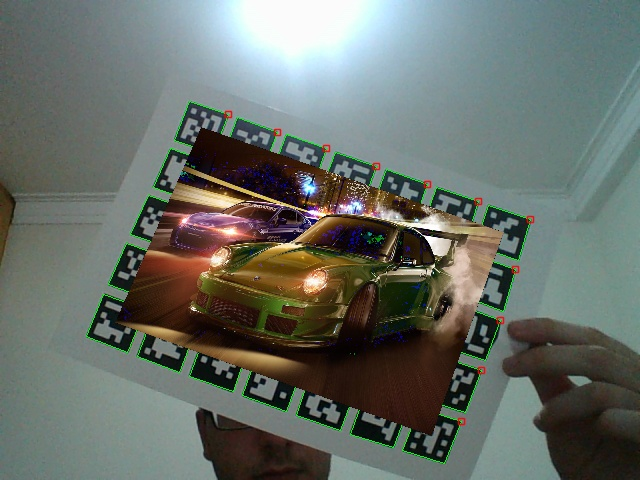

# ARView
Simple augmented reality project

## Explanation
The goal of this project is to project an image on an ArUco board. To do this we need to get the original image, calculate the homography needed to transform the image to the same pose as the board, and finally multiply the camera frame and the transformed image so it appears on the board.

First, we detect the ArUco markers, get the corner points of the board, get the corner points of the desired image, discover an homography that transforms the image to the same pose as the board and then warp the image.

The result is shown below:

